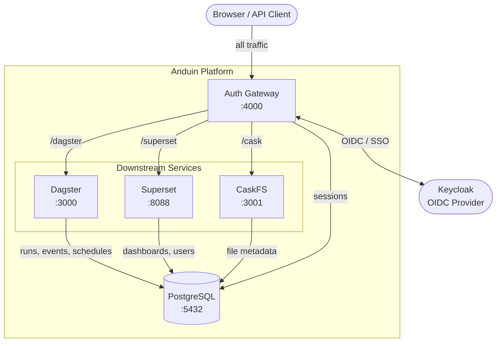
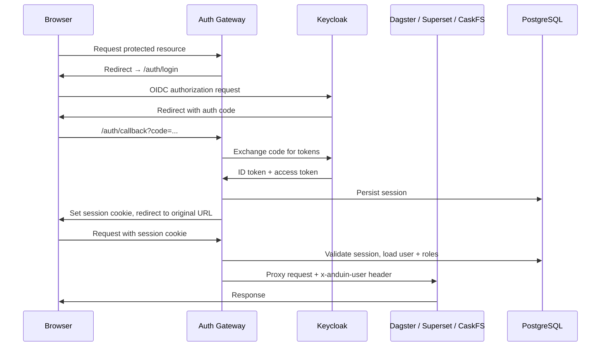

# Project Anduin

The data platform powering application data flows at the UC Davis Library. Anduin drives the harvest and ETL pipelines behind [Aggie Experts](https://experts.ucdavis.edu), the Library's research information management system, and serves as the shared infrastructure for data engineering and AI workloads across library applications.

## Contents

- [Overview](#overview)
- [Architecture](#architecture)
- [Services](#services)
- [Quick Start](#quick-start)
- [Authentication & Authorization](#authentication--authorization)
- [Dagster](#dagster)
- [Superset](#superset)
- [CaskFS](#caskfs)
- [Development](#development)

---

## Overview

Anduin is the UC Davis Library's central data platform. It currently powers the harvest pipelines for [Aggie Experts](https://experts.ucdavis.edu)—ingesting, transforming, and loading research data from external sources into the application—and is the shared foundation for data engineering and AI workloads across library systems.

The platform is built around three primary tools:

- **[Dagster](https://dagster.io)** — define, schedule, and monitor data pipelines and ETL jobs as software
- **[Apache Superset](https://superset.apache.org)** — explore pipeline outputs and build shareable dashboards
- **[CaskFS](https://github.com/ucd-library/caskfs)** — managed file storage for pipeline inputs, outputs, and intermediate artifacts

All three services sit behind a shared **Auth Gateway** that handles authentication via [Keycloak](https://www.keycloak.org) (OIDC/SSO) and enforces role-based access before proxying requests downstream. Users log in once and move between services without re-authenticating.

---

## Architecture

### Service Topology



The Auth Gateway is the **only** publicly exposed entry point. Downstream services are not directly accessible—they receive requests only via the gateway, which injects a verified user identity header (`x-anduin-user`) with each proxied request.

### Authentication Flow



---

## Services

| Service | Purpose | Local Port | Path Prefix | Links |
|---|---|---|---|---|
| Auth Gateway | Authentication, session management, reverse proxy | 4000 | `/` | — |
| Dagster | Workflow orchestration and asset pipelines | 3000 | `/dagster` | [dagster.io](https://dagster.io) |
| Dagster Daemon | Background scheduler and sensor runner | — | — | — |
| Superset | Data visualization and dashboards | 8088 | `/superset` | [superset.apache.org](https://superset.apache.org) |
| PostgreSQL | Shared relational database | 5432 | — | [postgresql.org](https://www.postgresql.org) |
| CaskFS | File storage and management | 3001 | `/cask` | [ucd-library/caskfs](https://github.com/ucd-library/caskfs) |

All services are defined in [`compose.yaml`](compose.yaml).

---

## Quick Start

**Prerequisites:** Docker and Docker Compose.

**1. Clone the repository**

```bash
git clone <repo-url>
cd project-anduin
```

**2. Configure environment**

Copy or create a `.env` file. At minimum, set your OIDC credentials:

```bash
# Keycloak / OIDC
OIDC_BASE_URL=https://auth.library.ucdavis.edu/realms/aggie-experts
OIDC_CLIENT_ID=anduin
OIDC_CLIENT_SECRET=<your-secret>
SESSION_SECRET=<random-string>
OIDC_JWT_SECRET=<random-string>

# Container images (from .cork-build registry)
IMAGE_PROJECT_ANDUIN_ANDUIN_PG=...
IMAGE_PROJECT_ANDUIN_DAGSTER=...
IMAGE_PROJECT_ANDUIN_SUPERSET=...
IMAGE_PROJECT_ANDUIN_AUTH_GATEWAY=...
IMAGE_CASKFS_CASKFS=...
```

**3. Start all services**

```bash
docker compose up
```

**4. Open the platform**

Navigate to [http://localhost:4000](http://localhost:4000). You will be redirected to Keycloak to log in. After authenticating, you are returned to the platform with access to the services your roles permit.

---

## Authentication & Authorization

Anduin uses [Keycloak](https://www.keycloak.org) as its central identity provider. The Auth Gateway validates every request, maintains sessions in PostgreSQL, and passes a verified user object to downstream services so they do not need to implement auth independently.

### Roles

Roles are assigned in Keycloak and extracted from the OIDC token on login. The gateway maps them to service-specific permissions:

| Role | Access |
|---|---|
| `admin` | Full access to all services and admin functions |
| `execute` | Access to Dagster (view and trigger pipelines) |
| `dashboard` | Access to Superset dashboards (read/interact) |
| `dashboard-admin` | Superset admin capabilities |
| `caskfs-*` | CaskFS role; prefix is stripped before forwarding |

See [`docs/roles.md`](docs/roles.md) for the full role reference and service-level mappings.

### Auth Modes

Services can receive their auth context in two ways:

- **Remote user header** (default) — the gateway sets `x-anduin-user` on every proxied request with a JSON user object including username, email, name, and roles. Superset and CaskFS consume this header directly.
- **Direct Keycloak** — Superset and CaskFS can also be configured to authenticate against Keycloak themselves, bypassing the gateway's header injection. Useful when services need to be accessed directly.

See [`docs/auth.md`](docs/auth.md) for configuration details and environment variables for each auth mode.

---

## Dagster

[Dagster](https://dagster.io) handles workflow orchestration: define jobs as Python code, schedule them, monitor runs, and track data assets over time.

**Web UI:** [http://localhost:4000/dagster](http://localhost:4000/dagster)

Access requires the `execute` or `admin` role. Dagster itself has no built-in auth—access control is enforced entirely by the Auth Gateway.

### Workspace

The active workspace is defined in [`dagster/workspace.yaml`](dagster/workspace.yaml) and currently points to the examples directory. The `dagster-daemon` container runs alongside the webserver to handle scheduled runs, sensors, and the run queue.

Dagster stores all run history, event logs, and schedule state in PostgreSQL (configured in [`dagster/dagster.yaml`](dagster/dagster.yaml)).

### Examples

The [`examples/`](examples/) directory contains reference implementations covering common patterns:

| Example | Pattern |
|---|---|
| `001_hello_world` | Basic job and asset definition |
| `002_batched_asset` | Asset materialization with partitions |
| `003_sensor_asset` | Sensor-triggered pipelines |
| `004_simple_cache` | Caching strategies |
| `005_nodejs_materialize` | Node.js client for the Dagster GraphQL API |

---

## Superset

[Apache Superset](https://superset.apache.org) provides the dashboarding layer. Connect it to PostgreSQL (or other databases), build charts, and share dashboards with users who have the `dashboard` role.

**Web UI:** [http://localhost:4000/superset](http://localhost:4000/superset)

Access requires the `dashboard`, `dashboard-admin`, or `admin` role.

### Key Capabilities

- Build and share charts and dashboards from SQL queries
- Import/export dashboards as `.zip` files (supports loading from local path or Google Cloud Storage)
- Role-based access maps Anduin roles to Superset's native `Alpha` / `Admin` / `Public` model

See [`docs/superset.md`](docs/superset.md) for setup instructions, PostgreSQL wiring, dashboard import, and Keycloak auth configuration.

---

## CaskFS

[CaskFS](https://github.com/ucd-library/caskfs) is a managed file storage service with access control. It provides an HTTP API for storing and retrieving files, with permissions governed by roles prefixed `caskfs-` in Keycloak.

**API base:** [http://localhost:4000/cask](http://localhost:4000/cask)

The gateway strips the `caskfs-` prefix before forwarding roles to CaskFS, so a Keycloak role of `caskfs-writer` becomes `writer` inside the service.

---

## Development

All services mount their source code as Docker volumes, so code changes take effect without rebuilding containers.

| Service | Mounted paths |
|---|---|
| Auth Gateway | `./auth-gateway/` (controllers, lib, client, index.js) |
| Dagster | `./examples/` → `/dagster/examples` |
| Superset | `superset_config.py`, `custom_security_manager.py` |

**Starting a specific service:**

```bash
docker compose up auth-gateway
docker compose up dagster dagster-daemon
```

**Auth Gateway entry point:** [`auth-gateway/index.js`](auth-gateway/index.js)  
**Auth Gateway config:** [`auth-gateway/lib/config.js`](auth-gateway/lib/config.js)  
**Dagster config:** [`dagster/dagster.yaml`](dagster/dagster.yaml), [`dagster/workspace.yaml`](dagster/workspace.yaml)  
**Superset config:** [`superset/superset_config.py`](superset/superset_config.py)  
**PostgreSQL init:** [`postgres/01_init_dbs.sql`](postgres/01_init_dbs.sql), [`postgres/02_init_anduin_dagster_tables.sh`](postgres/02_init_anduin_dagster_tables.sh)

### Disabling Auth Locally

Set `AUTH_ENABLED=false` in your `.env` to bypass OIDC. All requests will proceed unauthenticated. Do not use this in production.
